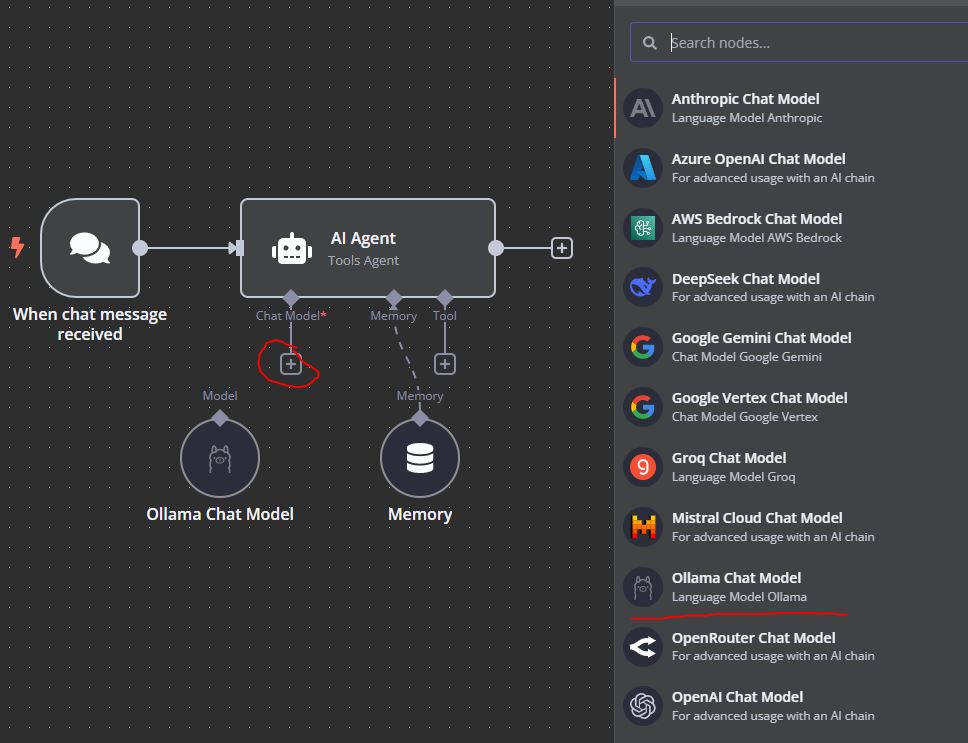
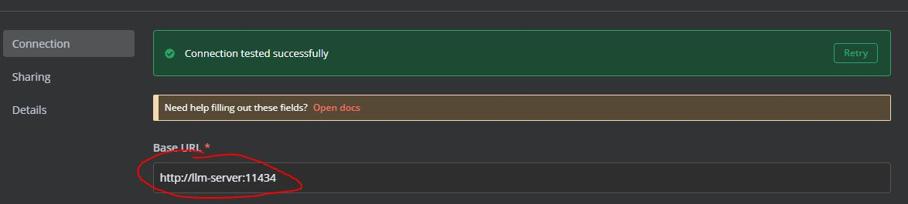
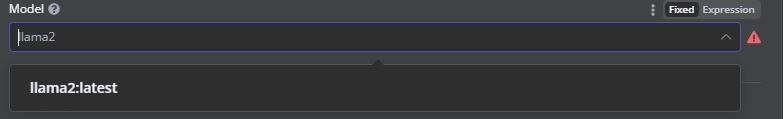
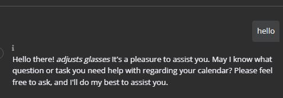

# Start-up

```bash
docker compose up
```

It should give a message going to ```localhost:5678``` in the terminal.

# Agent setup
First, after going through the first time registration, pick the AI agent example.

Then, delete the default OpenAI connection, press the '+' and pick Ollama


Double click on the Ollama node and configure the base URL with llm-server:11434 (internal docker connection)


Set the model to llama2:latest. If you wanted a different model, you need to change the model name in the ```ollama pull <model-name>``` part of ```DockerfileServer```


Try chatting!


# To do
- https://hub.docker.com/_/redis/
    - embedding and metadata storage
    